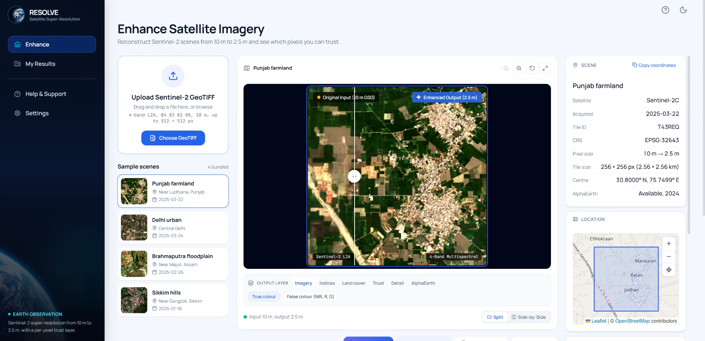
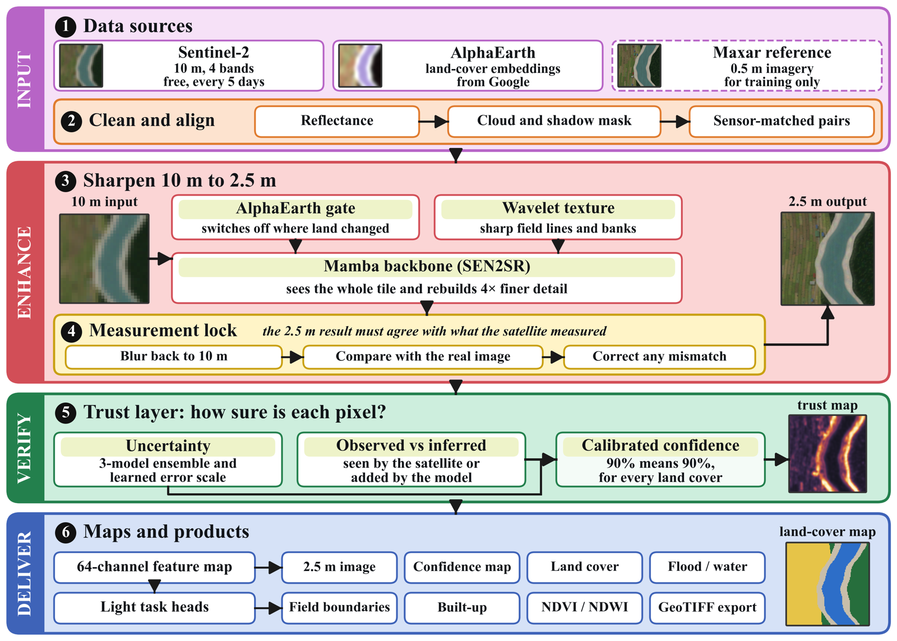

<div align="center">


# RESOLVE

### Trust-aware super-resolution of Sentinel-2 imagery, from 10 m to 2.5 m

Reconstruct Sentinel-2 scenes at four times their native resolution, keep every pixel consistent with what the satellite measured, and see which details were observed and which were inferred.

<br />

[](https://resolve-lovat-ten.vercel.app)
[](https://raone777-resolve-backend.hf.space/api/health)


<br />



<sub>The RESOLVE workspace: 10 m input and 2.5 m reconstruction in a split view, analysis layers, scene metadata and the tile footprint.</sub>

</div>

<br />

## Overview

Sentinel-2 observes the whole planet every five days, free of charge, but its 10 m pixels are too coarse for field boundaries, narrow roads, small buildings and flood edges. Deep super-resolution can sharpen these images, yet a sharper image is only useful if it stays true to the measurement and states where its detail came from.

RESOLVE treats super-resolution as an inverse problem. A Sentinel-2 tile is modelled as a blurred and decimated version of the unknown 2.5 m scene, `y = A x + n`, where `A` is the sensor operator. Every estimate splits uniquely into an **observed** part, fixed by the measurement, and an **inferred** part in the null space of `A`, which the sensor cannot see. RESOLVE lets its learned components act only on the inferred part, and it reports and calibrates the size of that part at every pixel.

## Architecture

<div align="center">

</div>

<br />

| Stage | Component | Role |
|---|---|---|
| **Input** | Sentinel-2 L2A, AlphaEarth embeddings | B4, B3, B2 and B8 at 10 m, with a 64-dimensional annual embedding of the previous year for each 10 m pixel |
| **Input** | Preprocessing | Surface reflectance, cloud and shadow masking, and sensor-matched patching through the fitted operator `A` |
| **Enhance** | Mamba backbone | Visual state-space blocks scan the feature map in four directions, giving a global receptive field at linear cost, and reconstruct 4× detail |
| **Enhance** | Wavelet texture branch | Dual-tree complex wavelet magnitudes with multiscale channel attention modulate the backbone features, `F' = F ⊙ (1 + g·W(F₀))`, to preserve fine edges |
| **Enhance** | Change-gated AlphaEarth context | The embedding enters through spatial adaptive normalisation, gated per pixel by `α = σ(k(cos(φ(y), e) − θ))`, so stale context switches off where the land has changed |
| **Enhance** | Measurement lock | The output is projected onto the set of images consistent with the measurement, `x̂ = z + Aᵀ(AAᵀ + λI)⁻¹(y − Az)`, so it reproduces the satellite image when blurred back to 10 m |
| **Verify** | Trust layer | Ensemble spread and a learned error scale give per-pixel uncertainty, the null-space energy gives the observed-versus-inferred score, and Mondrian conformal calibration states coverage per land-cover group |
| **Deliver** | Maps and products | A 64-channel feature field feeds light task heads for land cover, water and flood, field boundaries and built-up area, alongside NDVI, NDWI and the confidence map |

## Features

- **4× reconstruction.** Sentinel-2 four-band imagery at 10 m is reconstructed at 2.5 m, with the low frequencies locked to the measurement.
- **Observed versus inferred.** Every pixel separates detail the satellite measured from detail the model added.
- **Calibrated confidence.** Uncertainty and inferred detail are fused into one confidence map, so a stated confidence holds across water, cropland, forest and built-up land.
- **Change-aware context.** AlphaEarth embeddings for the tile's location guide reconstruction where the landscape is stable and are gated off where it has changed.
- **Analysis layers.** True colour, near-infrared false colour, NDVI, NDWI, water, land cover, built-up area, field boundaries, wavelet detail, backbone features, uncertainty, inferred detail, confidence, AlphaEarth context and the change gate, each with a legend and adjustable opacity.
- **Live processing view.** Each run shows the tile reconstructing patch by patch, with stage-by-stage timings and a processing log.
- **Geospatial output.** Results are georeferenced 2.5 m GeoTIFFs in the input coordinate system, with PNG layers, metadata and a printable report.

## Using RESOLVE

Open **[resolve-lovat-ten.vercel.app](https://resolve-lovat-ten.vercel.app)** and either pick one of the bundled scenes or upload your own tile.

| Requirement | Value |
|---|---|
| Format | GeoTIFF, Sentinel-2 Level-2A surface reflectance |
| Bands | 4 bands in the order B4, B3, B2, B8 (red, green, blue, near infrared) |
| Pixel size | 10 m |
| Tile size | Up to 512 × 512 pixels (5.12 × 5.12 km) |

Bundled scenes cover farmland near Ludhiana (Punjab), central Delhi, the Brahmaputra floodplain near Majuli (Assam) and the hills near Gangtok (Sikkim). Sentinel-2 tiles can be exported from the [Copernicus Browser](https://browser.dataspace.copernicus.eu).

After a run the workspace shows the input and output side by side or in a split slider, the analysis layers, and an inspector with scene metadata, the tile footprint on a map, processing metrics and the pipeline timings. Results can be downloaded as GeoTIFF, PNG, metadata JSON or a one-page report, and past runs are listed under **My Results**.

## Repository structure

```
RESOLVE/
├── src/                     Web application (React 19, TypeScript, Tailwind CSS)
│   ├── components/
│   │   ├── workspace/       Workspace, viewer, layer switcher, upload, sample gallery
│   │   ├── run/             Live processing view and pipeline timeline
│   │   ├── inspector/       Scene, map, metrics and pipeline cards
│   │   ├── pages/           My Results, Settings, Help, report
│   │   └── splash/          Start screen with the 3D Earth
│   └── lib/                 History, settings and export helpers
├── backend/                 Inference service (FastAPI, PyTorch)
│   ├── app/                 Model, measurement lock, analysis layers, AlphaEarth access
│   ├── samples/             Bundled Sentinel-2 scenes
│   └── tests/               API and component tests
└── docs/assets/             README images
```

## Data and credits

- **Sentinel-2.** Contains modified Copernicus Sentinel data, processed by ESA. Scenes accessed through the Microsoft Planetary Computer.
- **AlphaEarth Foundations Satellite Embedding dataset.** Google and Google DeepMind, CC-BY 4.0, accessed through Source Cooperative.
- **SEN2SR.** ESA OpenSR, Aybar et al. (2026), Remote Sensing of Environment. Pretrained weights CC0, `sen2sr` package MIT.
- **SEN2NAIP.** Aybar et al. (2024), Scientific Data. Sensor degradation model.
- **Map tiles.** © OpenStreetMap contributors, ODbL.
- **Earth imagery.** NASA Blue Marble.

## References

1. Aybar, C. et al. SEN2SR: a radiometrically and spatially consistent super-resolution framework for Sentinel-2. *Remote Sensing of Environment*, 2026.
2. Aybar, C. et al. SEN2NAIP: a large-scale dataset for Sentinel-2 image super-resolution. *Scientific Data*, 2024.
3. Brown, C. F. et al. AlphaEarth Foundations: an embedding field model for accurate and efficient global mapping from sparse label data. arXiv:2507.22291, 2025.
4. Gu, A. and Dao, T. Mamba: linear-time sequence modeling with selective state spaces. arXiv:2312.00752, 2023.
5. Wang, Y., Yu, J. and Zhang, J. Zero-shot image restoration using denoising diffusion null-space model. *ICLR*, 2023.
6. Angelopoulos, A. N. and Bates, S. A gentle introduction to conformal prediction and distribution-free uncertainty quantification. *Foundations and Trends in Machine Learning*, 2023.

<div align="center">
<br />
<sub>RESOLVE · Sentinel-2 super-resolution with a per-pixel trust layer</sub>
</div>
